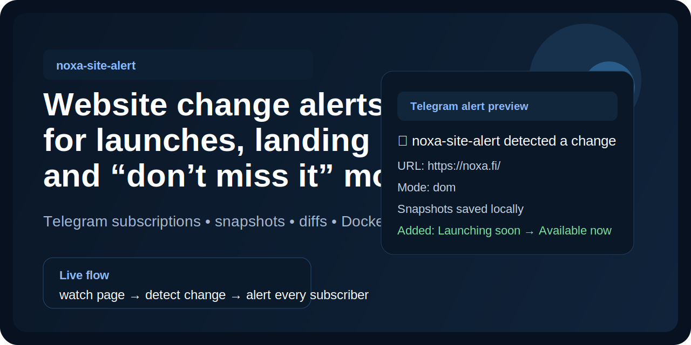
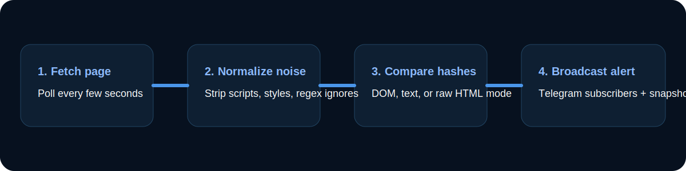

# noxa-site-alert

[](https://github.com/Semak12345/noxa-site-alert/actions/workflows/ci.yml)
[](LICENSE)
[](package.json)
[](https://t.me/NOXA_AlertBot)
[](https://t.me/NOXA_AlertBot)

Open-source website change monitoring for `https://noxa.fi/`.

It stores a baseline, checks the page on a schedule, and sends Telegram alerts when the site changes.

Public bot: [@NOXA_AlertBot](https://t.me/NOXA_AlertBot)



## What it does

- watches `https://noxa.fi/`
- keeps HTML and text snapshots
- alerts every Telegram user who pressed `/start`
- supports fixed admin/group delivery through `TELEGRAM_CHAT_ID`
- supports noise filtering for unstable pages
- runs on a small VPS, Docker, or any Node.js host

## Features

- preconfigured for `https://noxa.fi/`
- instant Telegram alerts on content change
- self-service subscriptions through `/start`
- local HTML and text snapshots for auditability
- three watch modes: `dom`, `text`, `html`
- fetch error and recovery alerts
- optional regex-based noise filtering for false positives
- automatic `.env` discovery for monorepos
- Docker and `docker-compose` support
- tiny-VPS-friendly `systemd` deploy path
- zero third-party runtime dependencies

## Flow



1. Fetch the target page
2. Normalize noisy markup
3. Compare hashes against the stored baseline
4. Broadcast a Telegram alert and save snapshots if something changed

## Quick start

### 1. Clone

```bash
git clone https://github.com/Semak12345/noxa-site-alert.git
cd noxa-site-alert
```

### 2. Configure

```bash
cp .env.example .env
```

Set at minimum:

- `TELEGRAM_BOT_TOKEN`

Optional:

- `TELEGRAM_CHAT_ID` for one fixed admin/group destination
- `TELEGRAM_THREAD_ID` for a Telegram forum topic
- `IGNORE_HTML_REGEX` or `IGNORE_TEXT_REGEX` if the page has noisy changing fragments

### 3. Create the first baseline

```bash
npm install
npm run init
```

This stores the current version of the page without sending an alert.

### 4. Start the watcher

```bash
npm start
```

Default polling interval is `10000ms`.

### 5. Subscribe in Telegram

Open [@NOXA_AlertBot](https://t.me/NOXA_AlertBot) and press `Start`.

You will get:

- a confirmation that you are on the alert list
- change alerts for `noxa.fi`
- outage and recovery alerts
- `/stop` support to unsubscribe

## Example alert

```text
🚨 NOXA website update detected
News: Changes were detected on noxa.fi.
Website: https://noxa.fi/
Open site: https://noxa.fi/
Detected at: 2026-07-22T16:19:25.000Z
Title: Noxa
Mode: dom

Added:
+ Available now

Removed:
- Coming soon
```

## Commands

```bash
npm run doctor
npm run init
npm run check
npm run test-alert
npm start
```

- `doctor` — prints resolved config and discovered env files
- `init` — saves the initial baseline
- `check` — runs a single fetch-and-compare cycle
- `test-alert` — sends a Telegram test message
- `start` — starts the continuous watcher loop

## Configuration

Core settings:

- `WATCH_URL` — target site. Default: `https://noxa.fi/`
- `WATCH_MODE` — `dom`, `text`, or `html`
- `POLL_INTERVAL_MS` — polling interval. Default: `10000`
- `REQUEST_TIMEOUT_MS` — fetch timeout. Default: `15000`
- `STATE_DIR` — state and snapshots directory. Default: `.data`
- `ENV_DISCOVERY` — auto-load nearby `.env` files. Default: `true`

Telegram settings:

- `TELEGRAM_BOT_TOKEN` — required bot token
- `TELEGRAM_CHAT_ID` — optional fixed chat, group, or channel id
- `TELEGRAM_THREAD_ID` — optional forum topic id
- `TELEGRAM_BROADCAST_SUBSCRIBERS` — broadcast to `/start` subscribers

Optional tuning:

- `SEND_STARTUP_PING` — send a startup Telegram message
- `IGNORE_HTML_REGEX` — remove noisy HTML fragments before hashing
- `IGNORE_TEXT_REGEX` — remove noisy text fragments before hashing

## Watch modes

`WATCH_MODE=dom`

- best default for most sites
- hashes normalized HTML
- catches structure and content changes while ignoring scripts/styles/comments

`WATCH_MODE=text`

- best if you only care about visible text changes
- good for “coming soon → live” transitions

`WATCH_MODE=html`

- strictest mode
- any raw HTML change will trigger

## False positives and tuning

Some pages change small noisy fragments on every request: timestamps, rotating counters, hydration ids, or build markers.

Use the ignore rules when that happens.

Single rule:

```bash
IGNORE_TEXT_REGEX=Last updated:.*
```

Multiple rules:

```bash
IGNORE_TEXT_REGEX=Last updated:.*||Build #[0-9]+
IGNORE_HTML_REGEX=data-hydration="[^"]+"||nonce="[^"]+"
```

Slash-delimited regex is also supported:

```bash
IGNORE_TEXT_REGEX=/last updated:.*/gi
```

Practical advice:

- start with `WATCH_MODE=text` if you only care about visible copy
- add ignore rules only after you observe noise
- keep rules narrow so you do not hide real changes
- run `npm run check` after each tuning change

## State and snapshots

State is stored in:

```text
.data/
  state.json
  subscribers.json
  snapshots/
    2026-07-22T12-00-00-000Z.html
    2026-07-22T12-00-00-000Z.txt
```

This gives you:

- the active baseline hash
- last successful check time
- latest snapshot paths
- the raw HTML snapshot
- extracted text used for diffing
- the Telegram subscriber list

## Telegram setup

1. Create a bot with `@BotFather`
2. Put the token into `.env`
3. Run `npm run test-alert`
4. If you want a fixed admin or group destination, add `TELEGRAM_CHAT_ID`
5. If you want public opt-in alerts, let users press `Start`
6. When a user presses `Start`, the bot confirms the subscription in English

Expected `/start` confirmation:

```text
✅ You are now on the NOXA alert list.
Website: https://noxa.fi/
If the NOXA website changes, you will receive an instant alert here.

Send /stop to unsubscribe.
```

## Docker

Build:

```bash
docker build -t noxa-site-alert .
```

Run:

```bash
docker run --rm \
  --env-file .env \
  -v "$(pwd)/.data:/app/.data" \
  noxa-site-alert
```

Or use compose:

```bash
docker compose up -d
```

## VPS deploy in 3 minutes

```bash
git clone https://github.com/Semak12345/noxa-site-alert.git
cd noxa-site-alert
cp .env.example .env
```

Fill in your bot token, then:

```bash
sudo mkdir -p /opt/noxa-site-alert
sudo rsync -a --delete ./ /opt/noxa-site-alert/
cd /opt/noxa-site-alert
sudo bash scripts/install-vps.sh
sudo systemctl start noxa-site-alert
sudo systemctl status noxa-site-alert
```

Useful commands after deploy:

```bash
sudo systemctl restart noxa-site-alert
sudo journalctl -u noxa-site-alert -f
```

## Monorepo-friendly env discovery

If this watcher lives inside a larger workspace, it can auto-load nearby `.env` and `.env.local` files from parent folders and common sibling app folders such as `frontend/`.

If you want strict local-only config:

```bash
ENV_DISCOVERY=false
```

## Use cases

- launch page monitoring
- startup landing pages
- “coming soon” trackers
- private alpha or allowlist watchers
- small group alert bots
- simple website proof-of-change monitoring

## Contributing

PRs are welcome. If you want to extend transports, tune diff behavior, or add deployment targets, open an issue or jump straight into a patch.

See [CONTRIBUTING.md](CONTRIBUTING.md).

## License

MIT — see [LICENSE](LICENSE).
